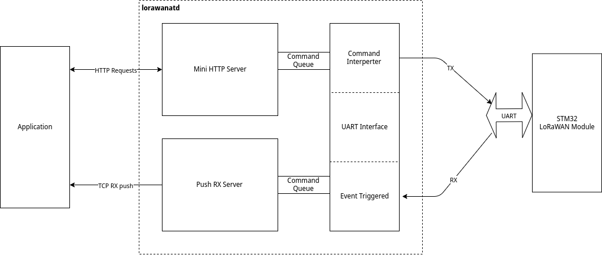

# LoRaWAN AT Deamon

*LoRaWAN AT* deamon interfaces though UART with *AT_Slave* firmware in *Canarin LoRa Module*. UART as used in *Canarin LoRa Module* is a duplex channel, where each TX commands will get a return RX message. The downlink from the gateway is also received as an RX message. *lorawanat* demultilexes one single UART channel to into TX and RX channels, in order to keep the application logic of indentification and parsing of incoming data in the interface layer. HTTP socket from where clients can send commands to the board and an RX socket which will be filled with incoming downlink data from lora.

# COMPILE

Run `./autogen.sh`.

The the autotool ritual `./configure` and `make`.

For cross compilation, pass `--host [cross-compiler]`, where cross compiler is the target of your choice. For example

`CFLAGS='-I/opt/sysroot-udoo/include/ -L/opt/sysroot-udoo/lib/ -DPSTDOUT -DNO_DEAMON -O0 -g' ./configure --host=arm-linux-gnueabihf --prefix=/opt/sysroot-linaro/usr/`

The compilation flags `-DPSTDOUT` will print logs in standard output instead of the syslog sybsystem. `-DNO_DEAMON` will not spawn a deamon but will run as a normal process.

# DEPENDENCIES

* libevent2

# Usage

`$ lorawanatd -d /dev/ttyXXXX`

`-r` flag can be used to allow access to the exposed ports from hosts in other machines.

HTTP port is 5555. TCP push port is 6666.

The API for HTTP usages are:

| URL       | Method     | Body                                                  | Description |
|-----------|------------|-------------------------------------------------------|-------------|
/reset      | GET        |                                                       | Triggers a soft reset of Lora module. LoRa hardware context are still saved and reloaded.|
/hard_reset | GET        |                                                       | Triggers a hard reset of Lora module. All LoRa hardware contexts are lost.|
/status     | GET        |                                                       | Replies 'OK' is Lora module is ok. |
/join       | GET        |                                                       | Initiates a join in OTAA. Timeouts if cannot join in time. |
/config/get | POST       | A json list with param name: `[ param1, param2, ...]` | Get parameter values. |
/config/set | POST       | A json directory with param name and value: `{ "command1" : "param1", "command2" : "param2", ...}` | Set parameter values. |
/send       | POST       | `{ "data" : "some data", "port" : 21 }`               | Send text data. |
/sendb      | POST       | `{ "data" : "ff20d10fe", "port" : 21 }`               | Send hexadecimal data. |
/force_update| GET       |                                                       | The MAC params are withheld until a successful join occours. Use this to force mac params to be written to the firmware. |

## Parameters list

| Parameter name         | Description       | Values  | /config/get | /config/set |
|------------------------|-------------------|---------|-------------|-------------|
| device_eui             | Device EUI        |         | :heavy_check_mark:         |              | 
| device_address         | Device address    |         | :heavy_check_mark:         | :heavy_check_mark: |
| application_key        | Application key   |         | :heavy_check_mark:         | :heavy_check_mark: |
| ~~network_session_key~~| Network session key |       |             | :heavy_check_mark:  |
| ~~application_session_key~~| Application session key |   |             |  :heavy_check_mark: |
| application_eui        | Application EUI   |         |  :heavy_check_mark:        | :heavy_check_mark:  |
| adaptive_data_rate     | Adaptive Data rate | 0: off, 1: on |  :heavy_check_mark: | :heavy_check_mark:  |
| transmit_power         | Transmit power    | 0-5     | :heavy_check_mark:         | :heavy_check_mark:  |
| data_rate              | Data Rate         | 0-7     |  :heavy_check_mark:        |  :heavy_check_mark: |
| ~~AT+DC~~              | Get or Set the ETSI Duty Cycle setting - 0=disable, 1=enable 
| ~~AT+PNM~~             | Get or Set the public network mode. (0: off, 1: on)     
| rx2_frequency          | Rx2 window frequency |      | :heavy_check_mark:         | :heavy_check_mark: | :heavy_check_mark: |
| rx2_data_rate          | Rx2 Window data rate. | 0-7|  :heavy_check_mark:         | :heavy_check_mark: |
| rx1_delay              | Delay between the end of the Tx and the Rx Window 1 in ms | |:heavy_check_mark: | :heavy_check_mark: |
| rx2_delay              | Delay between the end of the Tx and the Rx Window 2 in ms | |:heavy_check_mark: | :heavy_check_mark: | 
| join1_delay            | Join Accept Delay between the end of the Tx and the Join Rx Window 1 in ms |  |:heavy_check_mark: | :heavy_check_mark: |
| join2_delay            | Join Accept Delay between the end of the Tx and the Join Rx Window 2 in ms |  |:heavy_check_mark: | :heavy_check_mark: |
| network_join_mode      | Network Join Mode| 0: ABP, 1: OTAA| :heavy_check_mark:   |  :heavy_check_mark: |
| network_id             | Network Id       |          | :heavy_check_mark:         |  :heavy_check_mark:  |
| class                  | Device class     | A, B, C  | :heavy_check_mark:         | :heavy_check_mark:  |
| network_join_status    | Network join status | 0: not joined, 1: joined. | :heavy_check_mark: |   |
| confirmation_mode      | Comfirmation Mode | 0: no confirmation, 1: confirmation | :heavy_check_mark:  | :heavy_check_mark:  |
| confirmation_status    | Get confirmation status of last send | 0: not confirmed, 1: confirmed | :heavy_check_mark: | | 
| snr                    | Get SNR of last received packet | | :heavy_check_mark:     |   |
| rssi                   | Get RSSI of last recevied packet | | :heavy_check_mark:    |   |
| ~~frame_counter~~      | Set up and down frame counters  of LoraWan stack.| "[up]:[down]", up and down are uint32_t. |  |  :heavy_check_mark: |

## Handling persistant LoRaWAN data

The session keys, and frame counters and other hardware contexts are automatically saved when
* A join is successful
* Send and Receive events are successful for 10 times.

These saved contexts are loaded when
* The application is initializing
* When *soft* reset (/reset) is initiated.

*Hard* reset is the only way to delete the saved context and start afresh. (Motivated users can delete `CONTEXT_FILE` from the filesystem as well.)

~~**When network join mode is changed, it resets other parameters to default firmware values, take care to set network join mode first then change the other parameters.**~~
